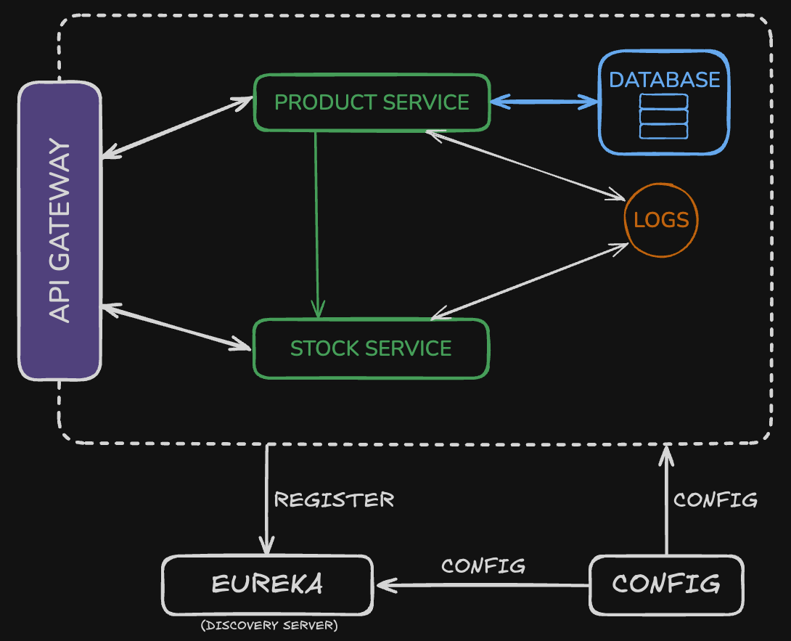

# Product Management Services

A microservices-based product management system with Spring Boot and Spring Cloud.

## Overview

This project consists of several microservices working together to provide product management functionality:

- **Config Server**: Centralized configuration management
- **Discovery Server**: Service registry using Eureka
- **API Gateway**: Single entry point for all client requests
- **Product Service**: Manages product data with PostgreSQL
- **Stock Service**: Handles stock information and communicates with Product Service

## 🏗️ Architecture



## ✅ Prerequisites

- Java 21
- Maven
- Docker (for PostgreSQL and Zipkin)
- PostgreSQL

## 🚀 Getting Started

### 1. Start Infrastructure:
Spin up the required infrastructure with Docker:
   ```bash
   docker-compose up -d
   ```

### 2. Start Microservices (⚠️ In Order):
The microservices must be started in the following order due to dependencies:

1. **🛠️ Config Server**
   ```bash
   cd config-server
   ./mvnw spring-boot:run
   ```

   ✅ Verify: http://localhost:8888/discovery/default

2. **📡 Discovery Server**
   ```bash
   cd discovery
   ./mvnw spring-boot:run
   ```

   ✅ Verify: http://localhost:8761 (Eureka dashboard)

3. **⚡ Start Remaining Services**
   Use the same command below for each of the remaining services: **Product**, **Stock**, and **Gateway**.
   ```bash
   cd <service-name>
   ./mvnw spring-boot:run
   ```

   🔁 Repeat for:
   - product
   - stock
   - gateway

   ✅ Gateway Health Check:
   http://localhost:8222/actuator/health

## ⚙️ Configuration
All services get their configuration from the Config Server.\
Service-specific configurations are in:
```bash
cd config-server/src/main/resources/config/
```

## 📊 Database
PostgreSQL container runs on port 5432.\
Default credentials:
- **Database**: `productdb`
- **Username**: `devuser`
- **Password**: `devpass`

## 🔍 Tracing
Distributed tracing with Zipkin.\
Access Zipkin UI at: http://localhost:9411

## 📚 API Documentation
Each service exposes interactive API docs via Swagger. You can explore them here:
- 🧾 Product Service: http://localhost:8090/swagger-ui/index.html
- 📦 Stock Service: http://localhost:8070/swagger-ui/index.html

## 📃 License
MIT License - See [LICENSE](LICENSE) for details.